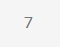
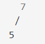
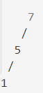
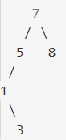
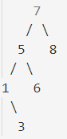
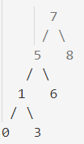
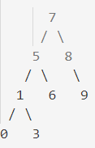
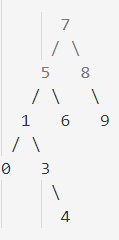
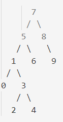

# Binary Search Tree Projesi - Proje 3

## [7, 5, 1, 8, 3, 6, 0, 9, 4, 2] -> Binary-Search-Tree

İlk olarak 7 rakamından başlayıp bunun kök düğüm olduğunu düşünerek en başa yerleştirelim:

5, 7 den küçük olduğu için sol tarafına konulur:

1, 7 den ve 5 ten küçük olduğu için sol en alt tarafa konulur:

8, 7 den büyük olduğu için sağ alt tarafa konulur:

3, 7 ve 5 ten küçük olduğu için onların sağına, 1 den büyük olduğu için onun sağına konulur:

6, 7 den küçük olduğu için 7 nin soluna 5 ten büyük olduğu için 5 in sağına konulur:

0, 7,5 ve 1 den küçük olduğu için sol en alta konulur:

9, 7 ve 8 den büyük olduğu için sağ alt tarafa konulur:

4, 7 ve 5 ten küçük olduğu için onların soluna , 1 den büyük olduğu için onun sağına ve 3 ten de büyük olduğu için onun sağına konulur:

2, 7 ve 5 ten küçük olduğu için onların soluna , 1 den büyük olduğu için onun sağına ve 3 ten de küçük olduğu için onun soluna konulur:

